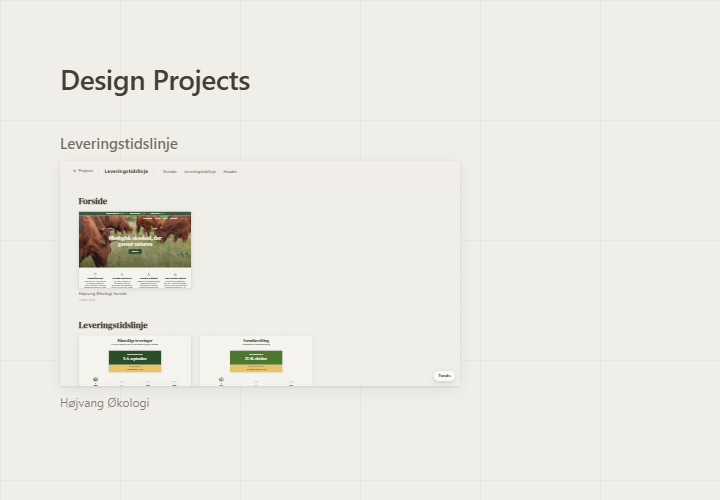
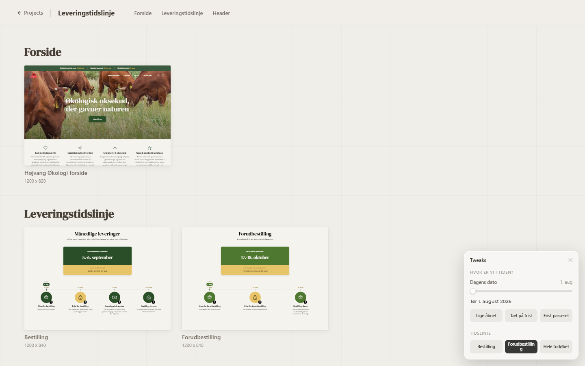
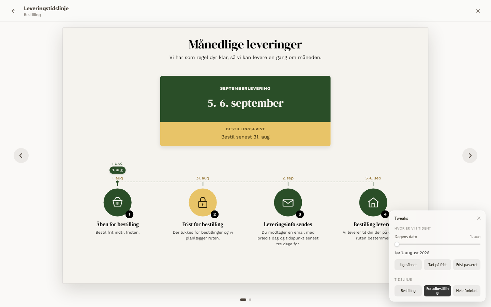
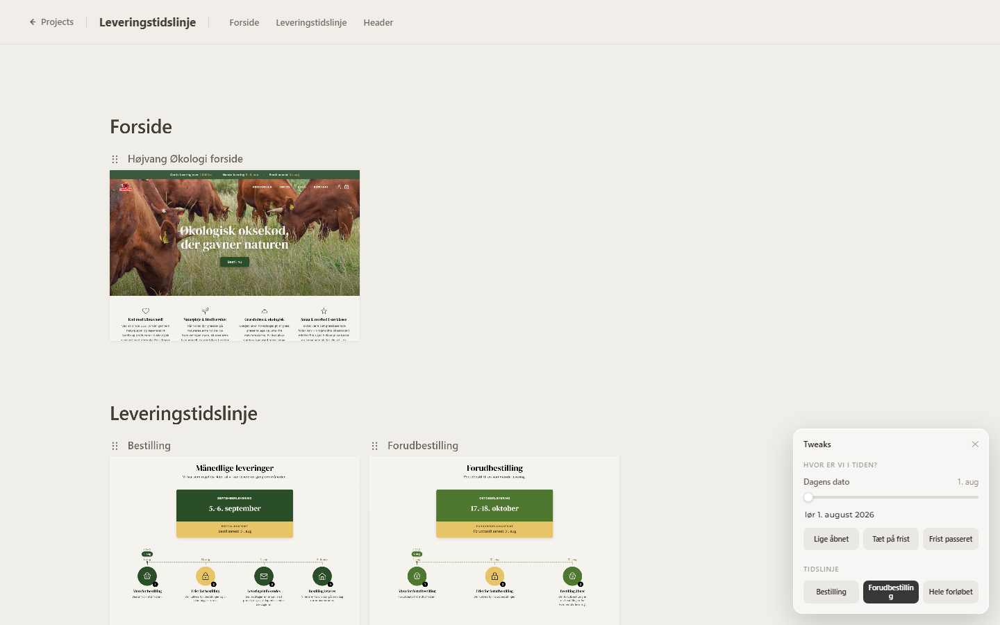

# AI Design Tool

A Vite/React workspace for design prototypes produced by an AI agent. You
brief the agent in natural language and iterate with it in the dev canvas.

## Screenshots

| Projects gallery | Project presenter |
| --- | --- |
|  |  |
| **Focused artboard** | **Design canvas (dev mode)** |
|  |  |

## Idea

Each design project is a normal React app.

The project owns its prototype components, data, styling, and tweak defaults.
The shared design tool runtime lives in `src/design-tool`.

## Workflow

You are the manager, the agent is the designer.

You brief the agent in natural language. It asks clarifying questions about
audience, fidelity, brand, and which tweaks to expose, then scaffolds a
child project under `projects/<slug>/` using the shared primitives below.
You review in the dev canvas, adjust live tweaks, and point at things to
change. The agent iterates until the work is ready to ship via the
presenter.

The agent's role and rules live in `.agents/system-prompt.md`. Task
procedures (wireframes, decks, prototypes, tweak panels, accessibility
audits, slop checks) live as skill files in `.agents/skills/` and are
loaded on demand.

## Project Apps

Project entry files live at `projects/<slug>/src/app.jsx`.

Each app describes its artboards with three shared primitives:

- `ProjectShell`
- `DCSection`
- `DCArtboard`

## Runtime Modes

`ProjectShell` chooses the right shell for the environment.

Dev mode uses the design canvas. It has pan, zoom, reorder, edit controls,
and canvas state writes.

Production uses the presenter. It has a gallery, fullscreen artboard view, and
readable hash links. It does not include reorder, delete, or canvas state writes.

## Tweaks

A floating panel exposes a small set of live controls for the current
project: color, copy, layout variants, dates, feature flags. Use it to
compare options without editing files. The panel is available in both dev
and presenter modes.

Values persist to `localStorage` and survive reloads. Defaults live in a
`TWEAK_DEFAULTS` block at the top of `src/app.jsx`, so the deployed version
always opens in a known state.

The panel is built from `useTweaks`, `TweaksPanel`, `TweakSection`, and
`TweakRow` in `src/design-tool`.

## Links

Local:

- `http://localhost:5173/`
- `http://localhost:5173/projects/leveringstidslinje/`
- `http://localhost:5173/projects/leveringstidslinje/#forside/hojvang-okologi-forside`
- `http://localhost:5173/projects/leveringstidslinje/#leveringstidslinje/bestilling`
- `http://localhost:5173/projects/leveringstidslinje/#leveringstidslinje/forudbestilling`

GitHub Pages:

- `https://christofferhbs.github.io/ai-design-tool/`
- `https://christofferhbs.github.io/ai-design-tool/projects/leveringstidslinje/`
- `https://christofferhbs.github.io/ai-design-tool/projects/leveringstidslinje/#forside/hojvang-okologi-forside`

## Commands

```bash
npm install
npm run dev
npm run dev:leveringstidslinje
npm run build
```

Create a new project:

```bash
npm run new-project -- my-project "My Project" "Description"
```

## Structure

```text
.
+-- .agents/              agent system prompt and skill procedures
+-- src/
|   +-- design-tool/      shared canvas, presenter, tweaks, Vite plugins
|   +-- ProjectsPage.jsx  project gallery at /
+-- projects/
|   +-- leveringstidslinje/
|       +-- src/app.jsx   project artboard tree and tweak defaults
|       +-- src/          project prototypes, data, theme, timeline code
+-- scripts/
|   +-- new-project.mjs   project scaffold helper
+-- projects.json         project list used by the gallery and Vite inputs
+-- vite.config.js        root multi-page Vite config
+-- .github/workflows/    GitHub Pages deploy
```

## Deploy

Pushing to `main` runs the GitHub Pages workflow. Pull requests run the build
only.
